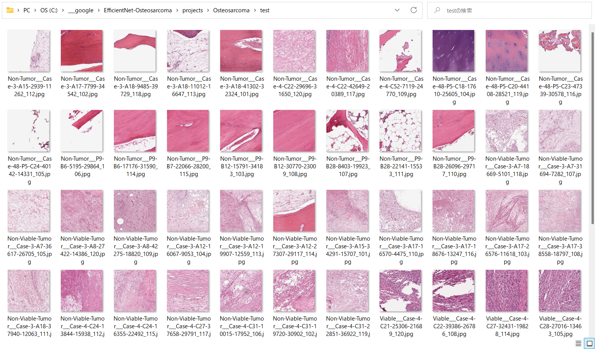

<h2>EfficientNet-Osteosarcoma (Updated: 2022/09/19)</h2>
<a href="#1">1 EfficientNetV2 Osteosarcoma Classification </a> 
<a href="#1.1">1.1 Clone repository</a> 
<a href="#1.2">1.2 Prepare Osteosarcoma dataset</a> 
<a href="#1.3">1.3 Install Python packages</a> 
<a href="#2">2 Python classes for Osteosarcoma Classification</a> 
<a href="#3">3 Pretrained model</a> 
<a href="#4">4 Train</a> 
<a href="#4.1">4.1 Train script</a> 
<a href="#4.2">4.2 Training result</a> 
<a href="#5">5 Inference</a> 
<a href="#5.1">5.1 Inference script</a> 
<a href="#5.2">5.2 Sample test images</a> 
<a href="#5.3">5.3 Inference result</a> 
<a href="#6">6 Evaluation</a> 
<a href="#6.1">6.1 Evaluation script</a> 
<a href="#6.2">6.2 Evaluation result</a> 

<h2>
<a id="1">1 EfficientNetV2 Osteosarcoma Classification</a>
</h2>

 This is an experimental EfficientNetV2 Osteosarcoma Classification project based on <b>efficientnetv2</b> in <a href="https://github.com/google/automl">Brain AutoML</a>.
 
 
The original Osteosarcoma-UT dataset has been taken from the following website: 
<pre>
---
Osteosarcoma data from UT Southwestern/UT Dallas for Viable and Necrotic Tumor Assessment 
(Osteosarcoma-Tumor-Assessment)
https://wiki.cancerimagingarchive.net/pages/viewpage.action?pageId=52756935
 
Summary:
 Osteosarcoma is the most common type of bone cancer that occurs in adolescents in the 
age of 10 to 14 years. The dataset is composed of Hematoxylin and eosin (H&E) stained 
osteosarcoma histology images. 
The data was collected by a team of clinical scientists at University of Texas Southwestern 
Medical Center, Dallas. 
 Archival samples for 50 patients treated at Children’s Medical Center, Dallas, between 1995 
and 2015, were used to create this dataset. 
Four patients (out of 50) were selected by pathologists based on diversity of tumor specimens 
after surgical resection. The images are labelled as Non-Tumor, Viable Tumor and Necrosis 
according to the predominant cancer type in each image. The annotation was performed by two 
medical experts. 
 All images were divided between two pathologists for the annotation activity. Each image had
a single annotation as any given image was annotated by only one pathologist. The dataset 
consists of 1144 images of size 1024 X 1024 at 10X resolution with the following distribution: 
536 (47%) non-tumor images, 263 (23%) necrotic tumor images and 345 (30%) viable tumor tiles.

Citations & Data Usage Policy
Users of this data must abide by the TCIA Data Usage Policy and the Creative Commons Attribution 3.0 
Unported License under which it has been published. Attribution should include references to the 
following citations:

Data Citation
Leavey, P., Sengupta, A., Rakheja, D., Daescu, O., Arunachalam, H. B., & Mishra, R. (2019). 
Osteosarcoma data from UT Southwestern/UT Dallas for Viable and Necrotic Tumor Assessment [Data set]. 
The Cancer Imaging Archive. https://doi.org/10.7937/tcia.2019.bvhjhdas

Publication Citation
1) Mishra, Rashika, et al. "Histopathological diagnosis for viable and non-viable tumor prediction 
for osteosarcoma using convolutional neural network." International Symposium on Bioinformatics 
Research and Applications. Springer, Cham, 2017.
2) Arunachalam, Harish Babu, et al. "Computer aided image segmentation and classification for viable
 and non-viable tumor identification in osteosarcoma." PACIFIC SYMPOSIUM ON BIOCOMPUTING 2017. 2017.
3) Mishra, Rashika, et al. "Convolutional Neural Network for Histopathological Analysis of Osteosarcoma."
 Journal of Computational Biology 25.3 (2018): 313-325.
4) Leavey, Patrick, et al. "Implementation of Computer-Based Image Pattern Recognition Algorithms to 
Interpret Tumor Necrosis; a First Step in Development of a Novel Biomarker in Osteosarcoma.
" PEDIATRIC BLOOD & CANCER. Vol. 64. 111 RIVER ST, HOBOKEN 07030-5774, NJ USA: WILEY, 2017.

TCIA Citation
Clark, K., Vendt, B., Smith, K., Freymann, J., Kirby, J., Koppel, P., Moore, S., Phillips, S., Maffitt, 
D., Pringle, M., Tarbox, L., & Prior, F. (2013). The Cancer Imaging Archive (TCIA): Maintaining and 
Operating a Public Information Repository. Journal of Digital Imaging, 26(6), 1045–1057. 
https://doi.org/10.1007/s10278-013-9622-7
</pre>

 We use python 3.8 and tensorflow 2.8.0 environment on Windows 11. 
 

<h3>
<a id="1.1">1.1 Clone repository</a>
</h3>
 Please run the following command in your working directory: 
<pre>
git clone https://github.com/atlan-antillia/EfficientNet-Osteosarcoma.git
</pre>
You will have the following directory tree: 
<pre>
.
├─asset
└─projects
    └─Osteosarcoma
        ├─eval
        ├─evaluation
        ├─inference
        ├─models
        ├─Osteosarcoma_Images
        └─test
</pre>
<h3>
<a id="1.2">1.2 Prepare Osteosarcoma dataset</a>
</h3>

Please download the dataset <b>Osteosarcoma-UT</b> from the following web site: 
<a href="https://wiki.cancerimagingarchive.net/pages/viewpage.action?pageId=52756935">
Osteosarcoma data from UT Southwestern/UT Dallas for Viable and Necrotic Tumor Assessment 
(Osteosarcoma-Tumor-Assessment)
</a>
 
 

As a working master dataset, we have created <b>Osteosarcoma-master</b> ]
dataset from the original <b>Osteosarcoma-UT</b> above
 by using python script <a href="./projects/Osteosarcoma/create_master_dataset.py">create_master_dataset.py</a>. 
<pre>
Osteosarcoma-master
  ├─Non-Tumor
  ├─Non-Viable-Tumor
  └─Viable
</pre>

Futhermore, we have created a <b>Osteosarcoma_Images</b> from <b>Osteosarcoma-master</b>.
 by using <a href="./projects/Osteosarcoma/split_master.py">split_master.py</a>
 
<pre>
Osteosarcoma_Images
├─test
│  ├─Non-Tumor
│  ├─Non-Viable-Tumor
│  └─Viable
└─train
    ├─Non-Tumor
    ├─Non-Viable-Tumor
    └─Viable
</pre>
The number of images in this Osteosarcoma_Images is the following: 
 
 
 
Osteosarcoma_Images/train/Non-Tumor: 

 
 
Osteosarcoma_Images/train/Non-Viable-Tumor: 

 
 
Osteosarcoma_Images/train/Viable: 

 
 

<h3>
<a id="#1.3">1.3 Install Python packages</a>
</h3>
Please run the following commnad to install Python packages for this project. 
<pre>
pip install -r requirements.txt
</pre>
 

<h2>
<a id="2">2 Python classes for Osteosarcoma Classification</a>
</h2>
We have defined the following python classes to implement our Osteosarcoma Classification. 
<li>
<a href="./ClassificationReportWriter.py">ClassificationReportWriter</a>
</li>
<li>
<a href="./ConfusionMatrix.py">ConfusionMatrix</a>
</li>
<li>
<a href="./CustomDataset.py">CustomDataset</a>
</li>
<li>
<a href="./EpochChangeCallback.py">EpochChangeCallback</a>
</li>
<li>
<a href="./EfficientNetV2Evaluator.py">EfficientNetV2Evaluator</a>
</li>
<li>
<a href="./EfficientNetV2Inferencer.py">EfficientNetV2Inferencer</a>
</li>
<li>
<a href="./EfficientNetV2ModelTrainer.py">EfficientNetV2ModelTrainer</a>
</li>
<li>
<a href="./FineTuningModel.py">FineTuningModel</a>
</li>

<li>
<a href="./TestDataset.py">TestDataset</a>
</li>

<h2>
<a id="3">3 Pretrained model</a>
</h2>
 We have used pretrained <b>efficientnetv2-m</b> to train Osteosarcoma Classification FineTuning Model.
Please download the pretrained checkpoint file from <a href="https://storage.googleapis.com/cloud-tpu-checkpoints/efficientnet/v2/efficientnetv2-m.tgz">efficientnetv2-m.tgz</a>, expand it, and place the model under our top repository.

<pre>
.
├─asset
├─efficientnetv2-m
└─projects
    └─Osteosarcoma
  ...
</pre>

<h2>
<a id="4">4 Train</a>

</h2>
<h3>
<a id="4.1">4.1 Train script</a>
</h3>
Please run the following bat file to train our Osteosarcoma Classification efficientnetv2 model by using
<b>Osteosarcoma_Images/train</b>.
<pre>
./1_train.bat
</pre>
<pre>
rem 1_train.bat
python ../../EfficientNetV2ModelTrainer.py ^
  --model_dir=./models ^
  --eval_dir=./eval ^
  --model_name=efficientnetv2-m  ^
  --data_generator_config=./data_generator.config ^
  --ckpt_dir=../../efficientnetv2-m/model ^
  --optimizer=rmsprop ^
  --image_size=384 ^
  --eval_image_size=480 ^
  --data_dir=./Osteosarcoma_Images/train ^
  --data_augmentation=True ^
  --valid_data_augmentation=True ^
  --fine_tuning=True ^
  --monitor=val_loss ^
  --learning_rate=0.0001 ^
  --trainable_layers_ratio=0.4 ^
  --dropout_rate=0.4 ^
  --num_epochs=50 ^
  --batch_size=4 ^
  --patience=10 ^
  --debug=True  
</pre>
, where data_generator.config is the following: 
<pre>
; data_generation.config

[training]
validation_split   = 0.2
featurewise_center = True
samplewise_center  = False
featurewise_std_normalization=True
samplewise_std_normalization =False
zca_whitening                =False
rotation_range     = 180
horizontal_flip    = True
vertical_flip      = True 
width_shift_range  = 0.2
height_shift_range = 0.2
shear_range        = 0.01
zoom_range         = [0.1, 3.0]
data_format        = "channels_last"

[validation]8
validation_split   = 0.2
featurewise_center = True
samplewise_center  = False
featurewise_std_normalization=True
samplewise_std_normalization =False
zca_whitening                =False
rotation_range     = 180
horizontal_flip    = True
vertical_flip      = True
width_shift_range  = 0.2
height_shift_range = 0.2
shear_range        = 0.01
zoom_range         = [0.1, 3.0]
data_format        = "channels_last"
</pre>

<h3>
<a id="4.2">4.2 Training result</a>
</h3>

This will generate a <b>best_model.h5</b> in the models folder specified by --model_dir parameter. 
Furthermore, it will generate a <a href="./projects/Osteosarcoma/eval/train_accuracies.csv">train_accuracies</a>
and <a href="./projects/Osteosarcoma/eval/train_losses.csv">train_losses</a> files
 
Training console output: 
 
 
Train_accuracies: 
 

 
Train_losses: 
 

 
<h2>
<a id="5">5 Inference</a>
</h2>
<h3>
<a id="5.1">5.1 Inference script</a>
</h3>
Please run the following bat file to infer the breast cancer in test images by the model generated by the above train command. 
<pre>
./2_inference.bat
</pre>
<pre>
rem 2_inference.bat
python ../../EfficientNetV2Inferencer.py ^
  --model_name=efficientnetv2-m  ^
  --model_dir=./models ^
  --fine_tuning=True ^
  --trainable_layers_ratio=0.4 ^
  --dropout_rate=0.4 ^
  --image_path=./test/*.jpg ^
  --eval_image_size=480 ^
  --label_map=./label_map.txt ^
  --mixed_precision=True ^
  --infer_dir=./inference ^
  --debug=False 
</pre>
 
label_map.txt:
<pre>
Non-Tumor
Non-Viable-Tumor
Viable
</pre>
 
<h3>
<a id="5.2">5.2 Sample test images</a>
</h3>

Sample test images generated by <a href="./projects/Osteosarcoma/create_test_dataset.py">create_test_dataset.py</a> 
from <a href="./projects/Osteosarcoma/Osteosarcoma_Images/test">Osteosarcoma_Images/test</a>.
 
 

<h3>
<a id="5.3">5.3 Inference result</a>
</h3>
This inference command will generate <a href="./projects/Osteosarcoma/inference/inference.csv">inference result file</a>.
 
 
Inference console output: 
 
 

Inference result (inference.csv): 
 
 
<h2>
<a id="6">6 Evaluation</a>
</h2>
<h3>
<a id="6.1">6.1 Evaluation script</a>
</h3>
Please run the following bat file to evaluate <a href="./projects/Osteosarcoma/Osteosarcoma_Images/test">
Osteosarcoma_Images/test</a> by the trained model. 
<pre>
./3_evaluate.bat
</pre>
<pre>
rem 3_evaluate.bat
python ../../EfficientNetV2Evaluator.py ^
  --model_name=efficientnetv2-m  ^
  --model_dir=./models ^
  --data_dir=./Osteosarcoma_Images/test ^
  --evaluation_dir=./evaluation ^
  --fine_tuning=True ^
  --trainable_layers_ratio=0.4 ^
  --dropout_rate=0.4 ^
  --eval_image_size=480 ^
  --mixed_precision=True ^
  --debug=False 
</pre>
 

<h3>
<a id="6.2">6.2 Evaluation result</a>
</h3>

This evaluation command will generate <a href="./projects/Osteosarcoma/evaluation/classification_report.csv">a classification report</a>
 and <a href="./projects/Osteosarcoma/evaluation/confusion_matrix.png">a confusion_matrix</a>.
 
 
Evaluation console output: 
 
 

 
Classification report: 
 
 
Confusion matrix: 
 

 
<h3>
References
</h3>
<b>1. Osteosarcoma data from UT Southwestern/UT Dallas for Viable and Necrotic Tumor Assessment  
(Osteosarcoma-Tumor-Assessment)</b> 
<pre>
https://wiki.cancerimagingarchive.net/pages/viewpage.action?pageId=52756935
</pre>

<b>2.Transfer Learning With Adaptive Fine-Tuning 
GREGA VRBANČIČ , (Graduate Student Member, IEEE), 
AND VILI PODGORELEC , (Member, IEEE) 
Faculty of Electrical Engineering and Computer Science, University of Maribor, 2000 Maribor, Slovenia
Corresponding author: Grega Vrbančič (grega.vrbancic@um.si)</b> 
<pre>
https://ieeexplore.ieee.org/stamp/stamp.jsp?arnumber=9241777
</pre>
